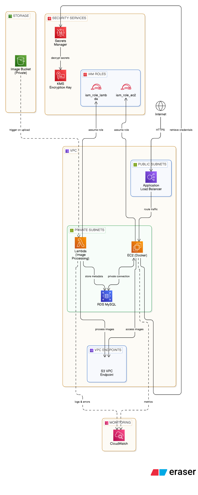

# PhotoShareAWSProject
PhotoShare is a secure, scalable, event-driven cloud application built on AWS using industry best practices.(Upgraded Version of KodeKloud Project)
# 📸 PhotoShare – Production-Grade AWS Architecture (Terraform Ready)


---

## 🚀 Overview

PhotoShare is a **secure, scalable, event-driven cloud application** built on AWS using industry best practices.

This project demonstrates how to design and implement a **production-ready architecture** with:

* 🔐 Strong security (IAM, private networking, encryption)
* ⚡ Event-driven processing (Lambda)
* 📦 Containerized application (Docker on EC2)
* 📊 Monitoring & alerting (CloudWatch)
* 🏗️ Infrastructure as Code ready (Terraform)

---

## 🧠 Architecture



---

## 🔄 How It Works

1. User accesses the app via **Application Load Balancer (ALB)**
2. ALB routes traffic to **EC2 (Docker app)**
3. User uploads an image:

   * Stored in **S3 (private bucket)**
   * Triggers **Lambda**
4. Lambda extracts metadata and sends it back via ALB
5. Backend stores metadata in **RDS (MySQL)**

---

## 🏗️ AWS Services Used

* VPC (Public + Private Subnets)
* EC2 (Dockerized Web App)
* Application Load Balancer (ALB)
* S3 (Private Storage)
* Lambda (Event Processing)
* RDS MySQL (Private Database)
* IAM (Role-based Access)
* Secrets Manager (Secure Credentials)
* KMS (Encryption)
* CloudWatch (Monitoring & Alerts)

---

## 🔐 Security Highlights

* ✅ Private RDS (no public access)
* ✅ S3 Block Public Access enabled
* ✅ No hardcoded credentials (IAM roles)
* ✅ Secrets stored in AWS Secrets Manager
* ✅ Encrypted using AWS KMS
* ✅ ALB as the only public entry point
* ✅ Security group-based access control

---

## ⚙️ Key Features

* Event-driven architecture using S3 + Lambda
* Secure secret management (no plaintext passwords)
* Fully containerized backend using Docker
* Production-style monitoring and alerting
* Designed for Terraform automation

---

## 🧪 Testing the Application

1. Open the ALB DNS in browser
2. Upload an image
3. Verify:

   * Image appears in S3
   * Lambda is triggered
   * Metadata processed successfully

---

## 📊 Monitoring

CloudWatch Dashboard includes:

* EC2 CPU Utilization
* Lambda Invocations

Alarm:

* Triggers when Lambda Errors > 0

---

## 🏗️ Terraform (Coming Next)

This project is being extended to fully automate infrastructure using Terraform.

### Planned Automation:

* VPC + Subnets
* EC2 + IAM Roles
* ALB + Target Groups
* RDS + Security Groups
* S3 + Lambda Trigger
* Secrets Manager
* CloudWatch Dashboards & Alarms

---

## 📁 Project Structure

```bash
photoshare-aws-terraform/
│
├── terraform/
├── app/
├── lambda/
├── docs/
├── README.md
```

---

## 🧠 Learning Outcomes

* Designing secure AWS architectures
* Implementing least-privilege IAM
* Building event-driven systems
* Managing secrets securely
* Monitoring distributed systems

---

## 🔥 Future Improvements

* HTTPS using ACM
* Auto Scaling Group
* CloudFront CDN
* CI/CD pipeline (GitHub Actions)
* Full Terraform automation

---

## 👨‍💻 Author

**Santosh Nagaraj**
M.Sc. Computer Science (Cybersecurity) – SRH Berlin

---

## ⭐ If you found this useful, consider starring the repo!
